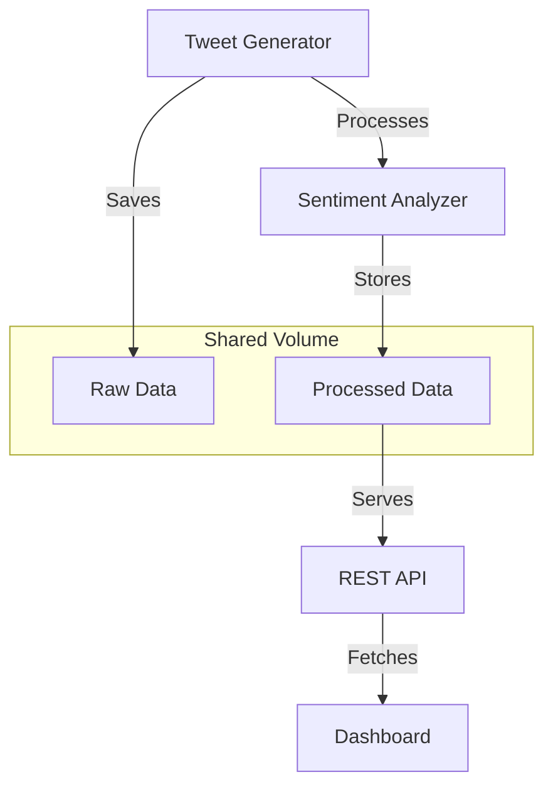

# Twitter Sentiment Analysis Pipeline


A real-time data processing pipeline that analyzes sentiment from Twitter data. This project demonstrates modern data engineering practices by building a complete system that ingests, processes, stores, and visualizes tweet data with sentiment analysis.


## 🌟 Features

- **Real-time data ingestion** - Simulates streaming Twitter data about tech topics
- **NLP-powered sentiment analysis** - Processes tweets to determine positive, negative, or neutral sentiment
- **RESTful API** - Provides access to both raw and processed data
- **Interactive dashboard** - Visualizes sentiment trends and topic distribution
- **Containerized architecture** - Runs seamlessly with Docker and Docker Compose
- **Modular design** - Components can be developed, scaled, and managed independently

## 📊 Architecture

This project follows a microservices architecture pattern with four main components:



### Components

1. **Tweet Generator**
   - Simulates a Twitter data stream with configurable volume and frequency
   - Generates tweets about popular tech topics with varied sentiment
   - Writes raw tweet data to the shared volume

2. **Sentiment Analyzer**
   - Monitors for new tweet data files
   - Uses TextBlob for natural language processing to determine sentiment
   - Calculates polarity and subjectivity scores
   - Saves processed results with sentiment tags

3. **API Service**
   - Built with FastAPI for high performance
   - Provides endpoints for querying tweets and summary statistics
   - Supports filtering by sentiment and topic
   - Offers comprehensive API documentation via Swagger UI

4. **Dashboard**
   - Interactive web interface built with Dash and Plotly
   - Real-time updating visualizations of sentiment and topic distribution
   - Responsive design with modern styling
   - Tabular view of recent tweets with color-coded sentiment indicators

## 🚀 Getting Started

### Prerequisites

- Docker and Docker Compose
- Git

### Quick Start

1. Clone the repository:
   ```bash
   git clone https://github.com/yourusername/twitter-sentiment-pipeline.git
   cd twitter-sentiment-pipeline
   ```

2. Start the application:
   ```bash
   docker-compose up -d
   ```

3. Access the components:
   - Dashboard: [http://localhost:8050](http://localhost:8050)
   - API Documentation: [http://localhost:8000/docs](http://localhost:8000/docs)

4. View the logs:
   ```bash
   docker-compose logs -f
   ```

### Running Without Docker

If you prefer to run the services directly:

1. Install dependencies:
   ```bash
   pip install -r requirements.txt
   ```

2. Start each component in a separate terminal:
   ```bash
   # Terminal 1: Generate tweets
   python src/ingestion/tweet_generator.py
   
   # Terminal 2: Process tweets
   python src/processing/sentiment_analyzer.py
   
   # Terminal 3: Start the API
   uvicorn src.api.app:app --host 0.0.0.0 --port 8000
   
   # Terminal 4: Start the dashboard
   python src/api/dashboard.py
   ```

## 📋 API Documentation

The API provides the following endpoints:

### GET /tweets
Retrieves processed tweets with optional filtering.

**Query Parameters:**
- `limit` (integer): Maximum number of tweets to return
- `sentiment` (string): Filter by sentiment (positive, negative, neutral)
- `topic` (string): Filter by topic

**Example:**
```
GET /tweets?limit=10&sentiment=positive
```

### GET /summary
Returns summary statistics of the processed tweets.

**Response:**
```json
{
  "total_tweets": 152,
  "sentiment_distribution": {
    "positive": 91,
    "neutral": 31,
    "negative": 30
  },
  "topic_distribution": {
    "data engineering": 28,
    "machine learning": 31,
    "python": 34,
    "big data": 25,
    "cloud computing": 34
  },
  "avg_polarity": 0.23,
  "avg_subjectivity": 0.52
}
```

## 📁 Project Structure

```
twitter-sentiment-pipeline/
├── data/
│   ├── raw/         # Raw tweets storage
│   └── processed/   # Processed tweets with sentiment
├── docker/
│   ├── Dockerfile.generator   # Tweet generator container
│   ├── Dockerfile.analyzer    # Sentiment analyzer container
│   ├── Dockerfile.api         # API service container
│   └── Dockerfile.dashboard   # Dashboard container
├── src/
│   ├── ingestion/
│   │   └── tweet_generator.py
│   ├── processing/
│   │   └── sentiment_analyzer.py
│   └── api/
│       ├── app.py             # FastAPI application
│       └── dashboard.py       # Dash dashboard application
├── docker-compose.yml         # Service orchestration
├── requirements.txt           # Python dependencies
└── README.md                  # This file
```

## 🔧 Configuration

You can configure the application behavior through environment variables in the docker-compose.yml file:

- `TWEET_COUNT`: Number of tweets to generate (default: 1000)
- `TWEET_DELAY`: Delay between tweet generation in seconds (default: 2.0)

## 🛠️ Technology Stack

- **Python 3.9**: Core programming language
- **TextBlob**: Natural language processing for sentiment analysis
- **FastAPI**: Modern, high-performance web framework
- **Dash & Plotly**: Interactive visualization framework
- **Docker & Docker Compose**: Container orchestration
- **Pandas**: Data manipulation and analysis

## 🔮 Future Improvements

- Replace simulated data with real Twitter API integration
- Add persistent database storage with PostgreSQL or MongoDB
- Implement user authentication and API keys
- Add more sophisticated sentiment analysis using machine learning models
- Scale the processing pipeline with Apache Kafka and Spark
- Add CI/CD pipeline for automated testing and deployment
- Integrate with cloud providers (AWS, GCP, Azure)

## 📝 License

This project is licensed under the MIT License - see the LICENSE file for details.

## 👥 Contributing

Contributions are welcome! Please feel free to submit a Pull Request.

1. Fork the repository
2. Create your feature branch (`git checkout -b feature/amazing-feature`)
3. Commit your changes (`git commit -m 'Add some amazing feature'`)
4. Push to the branch (`git push origin feature/amazing-feature`)
5. Open a Pull Request

## 📬 Contact

Naushil Khajanchi - [nkhajanc@usc.edu](mailto:nkhajanc@usc.edu)

Project Link: [https://github.com/Naushil7/twitter-sentiment-pipeline](https://github.com/Naushil7/twitter-sentiment-pipeline)
